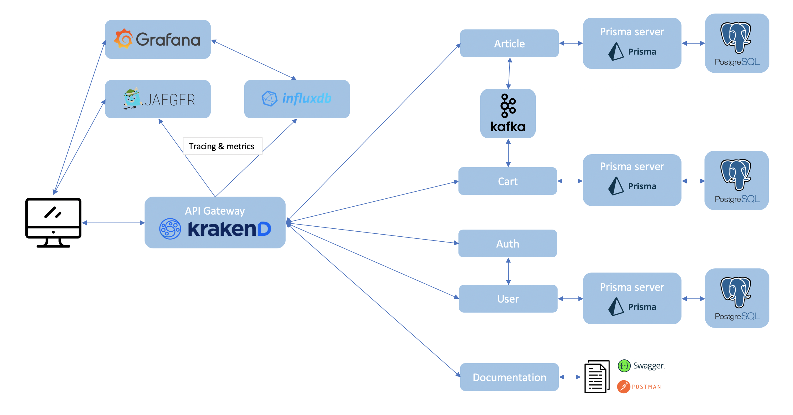

# POC microservices

Example of a specs driven development microservices (SDD) architecture using code generation.
The project is keeping simple but includes all the necesary tools to be production ready. The business logic implemented does not really matter, the goal is to demonstrate how a SDD can be organized and the good pratices of a microservices architecture.

# Quick start

* Docker installed
* Run: `./services/launcher.sh`
* Run: `./services/gateway-launcher.sh`
* Play with the API ! see documentation at [http://localhost:9898/documentation](http://localhost:9898/documentation) and use the postman files in [services/documentation/postman](services/documentation/postman)
* see: [services](services) for more information

What you can do: 

* Create/update/get articles 
* Add articles in the cart, update/get cart items 
* Delete an article that is in the cart: will delete the article from the cart thanks to a kafka event
* Checkout the cart: will edit the stock of articles with a kafka event
* If you don't have an auth token you can do nothing on user service
* Signup and login (auth service) to get a token
* You can now access the user service except deleting a user: requires a special role in the token

# Project structure

## **Generator**

A generator using spec files for our microservices. To know how to use it or how it works, see: [generator](generator).

## **Services**

All the microservices of the architecture, which include two business services, an API gateway and a service to expose the documentation (swagger docs and postman collections). To know how to run them or how to create/update some, see: [services](services).

## **Specification**

The API and pub/sub event specifications, and the datamodel of each microservice. To know how to create/update the specifications, see: [specification](specification).
